<div align="center">

# 🚗 RoCar

### A multimodal deep learning price predictor for the Romanian second-hand car market

Bachelor's Thesis, University of Bucharest, Faculty of Mathematics and Computer Science

[](https://raw.githubusercontent.com/hutanmihai/bachelor-thesis/main/bachelor-thesis-hutanmihai.pdf)
[](https://raw.githubusercontent.com/hutanmihai/bachelor-thesis/main/docs/thesis-slides.pdf)
[](https://www.python.org/)
[](https://pytorch.org/)
[](https://fastapi.tiangolo.com/)
[](https://nextjs.org/)

</div>

---

## 📋 Table of Contents

- [Overview](#-overview)
- [Why RoCar](#-why-rocar)
- [Repository Structure](#-repository-structure)
- [The Dataset](#-the-dataset)
- [The Model](#-the-model)
- [Results](#-results)
- [The Web Application](#-the-web-application)
- [App Screenshots](#-app-screenshots)
- [Getting Started](#-getting-started)
- [Documentation](#-documentation)
- [Author](#-author)

---

## 🔎 Overview

The second-hand car market in Romania is continually growing, registering over **660,000 transactions in 2023** according to Autovit. That expansion comes with a persistent problem: inflated and opaque used car prices.

**RoCar** is a web application built for the Romanian automotive market that predicts vehicle prices using a model trained on a dataset scraped independently for this thesis. What sets it apart from comparable tools is that it does not stop at structured data (year, manufacturer, model, options). It also reads the **free text description** and the **listing photo**, combining all three signals in a **multimodal architecture**.

The model is available for inference both through a web interface and through a documented REST API, so it can serve individual buyers as well as businesses that want to integrate valuations into their own workflows.

| | |
|---|---|
| 🕸️ **Dataset** | 46,893 advertisements scraped from Autovit, over 160 GB of images |
| 🧠 **Model** | Romanian BERT + FastViT + MLP over structured features |
| 🎯 **Best result** | MAE of **1561 EUR**, R² of **0.934** on the test set |
| ⚙️ **Backend** | FastAPI, PostgreSQL, SQLAlchemy, Alembic, S3, Stripe, JWT |
| 🎨 **Frontend** | Next.js, Shadcn, Tailwind CSS |
| 🚀 **Deployment** | Docker on Render (API) and Vercel (UI), CI/CD via GitHub Actions |

---

## 💡 Why RoCar

Buying a second-hand car usually follows the same path: browse forums, then browse listing platforms such as OLX and Autovit, then build a shortlist. At that point the buyer is stuck with two questions that no listing answers: **is this car overpriced, and is there room to negotiate?**

Pricing is genuinely hard. Two identical models from the same manufacturer can differ by thousands of euros because of features that look minor on paper, like heated seats or an advanced infotainment system. Existing price predictors typically consider only a narrow set of structured data points and miss exactly that kind of detail, which is almost always mentioned in the advertisement description or visible in the photos.

RoCar targets two audiences:

- **Individual buyers** with limited automotive knowledge, who need an unbiased reference price before negotiating.
- **Car rental and fleet businesses**, which routinely struggle to value ageing fleet vehicles and end up either selling well under market value or leaving cars in storage. The API makes bulk valuation part of their workflow.

---

## 📁 Repository Structure

```
bachelor-thesis/
├── scraper/     # Autovit scraper: URL collection, ad extraction, image download, merging
├── core/        # Notebooks: analysis, preprocessing, finetuning, multimodal training
├── backend/     # FastAPI service exposing the model, auth, payments and history
├── frontend/    # Next.js user interface (rocar-price-prediction)
└── docs/        # LaTeX sources, slides, diagrams and figures
```

| Directory | What lives there |
|---|---|
| `scraper/src` | `scrape_ads.py`, `extract_ads.py`, `download_images.py`, `check_images.py`, `merge_data.py`, `final_check.py` |
| `core/src` | `analysis.ipynb`, `format.ipynb`, `split.ipynb`, `mlp.ipynb`, `finetune_bert.ipynb`, `finetune_fastvit.ipynb`, `precompute_embeddings.ipynb`, `multimodal.ipynb` |
| `backend/src` | `apis/`, `services/`, `repositories/`, `schemas/`, `models/`, `auth/`, `tests/`, plus `ml.py` and `download.py` |
| `frontend/rocar-price-prediction` | Next.js app with six pages: landing, pricing, login, register, dashboard, prediction |

---

## 🗃️ The Dataset

No large public dataset of Romanian second-hand car prices existed, so one had to be built.

### Source selection

Autovit and OLX are the two dominant platforms. **Autovit** was chosen as the single source because it enforces more mandatory fields when a listing is created, which yields richer data, and because scraping both would have introduced duplicate entries across platforms. Only **undamaged** cars were collected, since damaged vehicles introduce large variability in usability and condition that the model cannot observe.

### Scraping pipeline

| Stage | What it does |
|---|---|
| **1. URL Collection** | Walks the accessible pages of the site (the latest 500, due to pagination limits) and collects advertisement URLs, skipping duplicates. |
| **2. Detailed Ad Scraping** | Extracts parametric data, custom options such as heated seats or infotainment, and the full description. |
| **3. Image Download** | Downloads the first ten images per advertisement, over 160 GB in total. |
| **4. Data Integration** | Merges each weekly run into the growing dataset. |

Three engineering problems shaped the scraper:

- **Speed.** A single threaded crawl was far too slow, so scraping runs through a `ThreadPoolExecutor`, processing rows in parallel.
- **Network errors.** Every failed request retries automatically up to five times before being skipped, which sharply reduced data loss from transient failures.
- **Limited availability.** Autovit exposes only the last 500 pages, roughly 15,000 ads at any moment. Running the scraper **weekly** added around 5,000 fresh advertisements per cycle, which is how the dataset reached 46,893 entries.

Collection respected Autovit's terms of service and data privacy policies.

### Formatting and cleaning

The raw data arrived messy: numbers carried units (`"1237 km"`), prices came in several formats (`1298.23`, `1294,41`, `1239`), and booleans were Romanian strings (`"da"` and `"nu"`). Regular expressions stripped units, all measures were standardised, and booleans were mapped to `True` and `False`.

Descriptions were **enriched**: because Romanian sellers habitually list equipment inside the description, the custom option columns (audio and technology, comfort, electronics and assistance, performance, safety) were appended to the description in the same enumerated style sellers use. The inference endpoint replicates this step when a user fills in the optional equipment fields.

<div align="center">
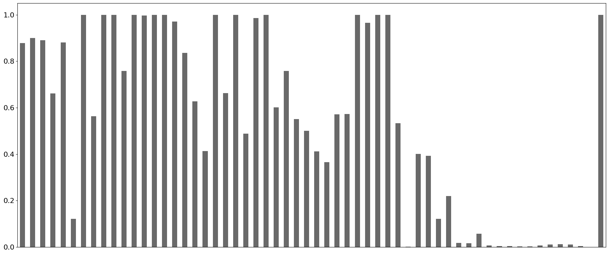
<br><em>Non-null values per feature in the raw scraped dataset</em>
</div>

Cleaning removed whole categories and then trimmed outliers:

| Removal | Reason | Rows removed |
|---|---|---|
| Electric vehicles | Only 1326 samples, plus EV specific pricing drivers such as range and battery capacity | 1326 |
| Leasing vehicles | Only 322 samples, incomplete leasing terms make real price impossible to approximate | 322 |
| Tuned cars | Highly variable and poorly documented | 482 |
| Non EUR prices | Some RON listings actually contained EUR figures | 46 |
| Error prone boolean columns | Nulls could not safely be read as `False` | 210 |
| `power` outside 50 to 600 HP | Unrealistic for passenger cars | 218 |
| `engine capacity` outside 500 to 4000 cc | Excludes motorcycles and trucks posted by mistake | 305 |
| `price` above 40,000 EUR | Luxury and rare models, outside the target market | 3911 |
| `km` above 500,000 | Very small subset | 30 |
| Manufacturers with fewer than 100 listings | Too little data to learn a reliable brand effect | 482 |

Columns with heavy nulls (fuel consumption, pollution, vehicle history) and sparse columns (`generation`, `version`) were dropped entirely.

<div align="center">
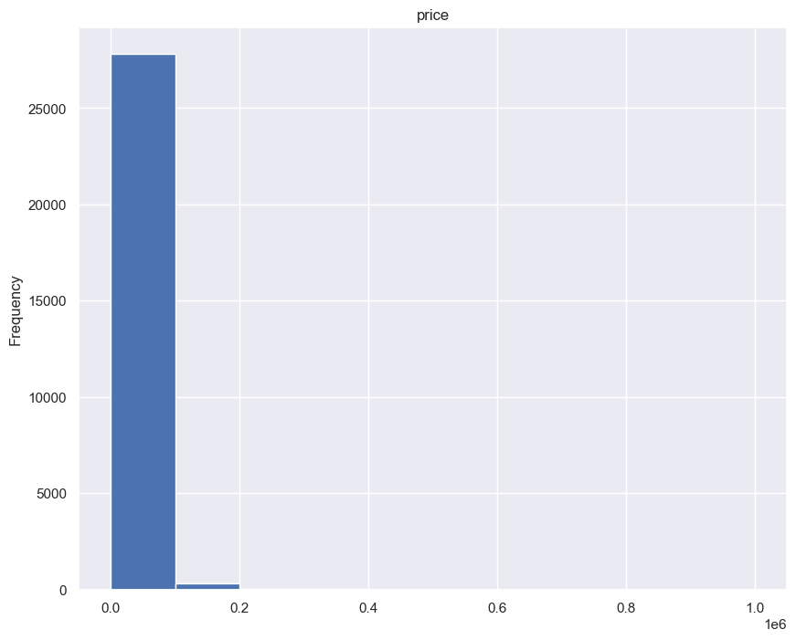
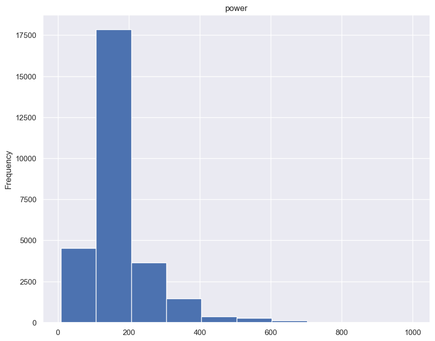
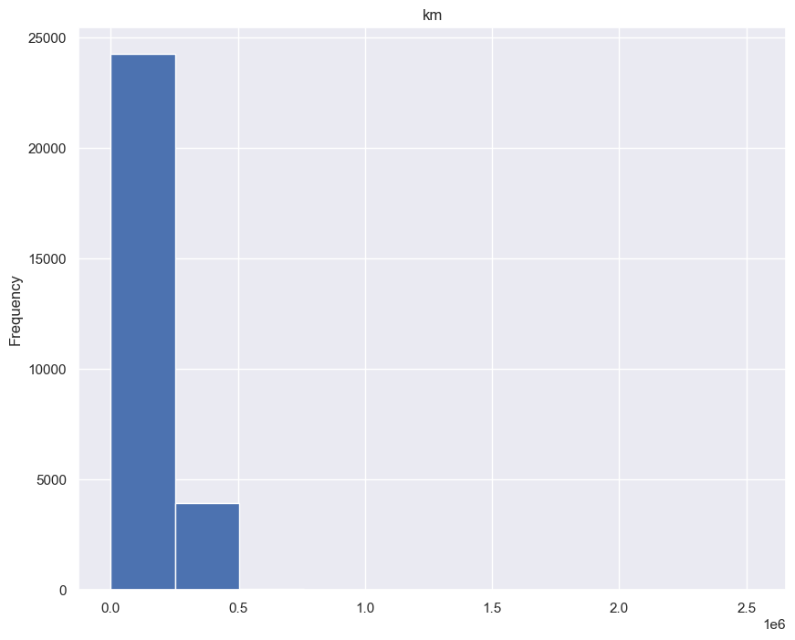
<br><em>Feature distributions before outlier filtering</em>
</div>

### Final schema

| Column | Discrete / Continuous | Type |
|---|---|---|
| `price` | continuous | number |
| `manufacturer` | discrete | text |
| `model` | discrete | text |
| `year` | continuous | number |
| `km` | continuous | number |
| `power` | continuous | number |
| `engine capacity` | continuous | number |
| `fuel` | discrete | text |
| `chassis` | discrete | text |
| `is_automatic` | discrete | boolean |
| `sold_by_company` | discrete | boolean |
| `description` | continuous | text |

### What the data says

The analysis confirmed that the dataset reflects real market behaviour: prices are right skewed and concentrated between 5,000 and 15,000 EUR, most listings are for cars five to ten years old, mileage clusters between 100,000 and 250,000 km, and newer or lower mileage cars command higher prices. Power and engine capacity correlate positively with price. Volkswagen, BMW and Audi dominate by volume, while Mercedes, Porsche and Volvo sit at higher price points. Diesel cars are slightly more expensive, coupes and SUVs outprice city cars, automatics resell higher, and business sellers price above private ones.

<div align="center">
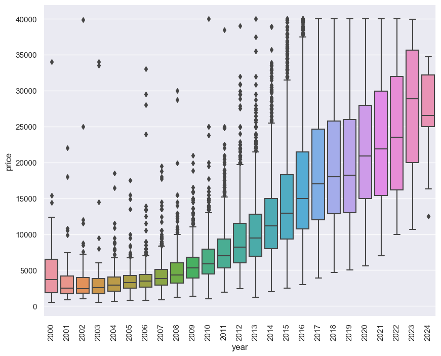
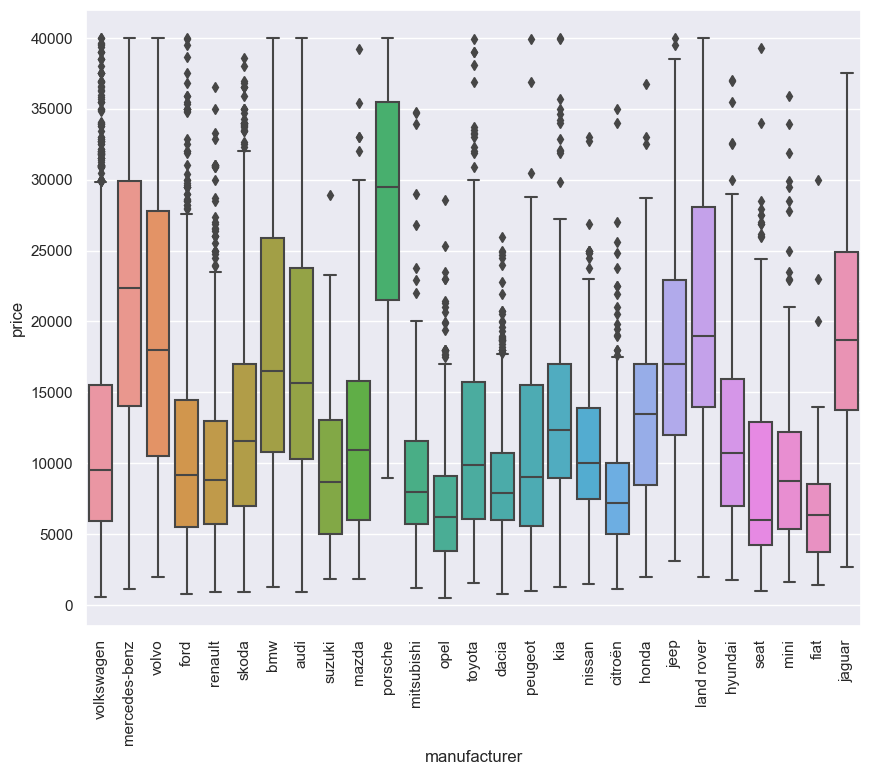
</div>

For the text side, `langdetect` exposed a mix of languages (23,964 Romanian, 478 Italian, 228 English and a long tail), and every non Romanian description was removed because the text encoder is Romanian specific. Emails, phone numbers, URLs, HTML tags and a surprising volume of emoji were stripped with regular expressions and the `emoji` package.

<div align="center">
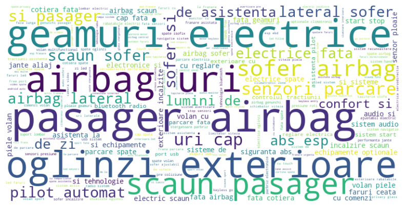
<br><em>Most frequent terms in the descriptions, dominated by equipment keywords</em>
</div>

For the image side, analysis was manual. Listing photos follow no consistent angle, and company posted ads often carry promotional banners that would confuse the encoder. Scraping ten images per ad left a large enough pool to hand pick one clean front-to-side photo per sample.

---

## 🧠 The Model

### Preprocessing

Booleans became integers and categorical columns were **target encoded** rather than one-hot encoded, since one-hot produced extremely sparse features (each manufacturer carries five to thirty models). All numeric inputs then passed through `StandardScaler`. Unusually for regression, **the target itself was also scaled**, which improved accuracy across every model tried. All fitted encoders and scalers are pickled so inference reproduces the exact transformation.

### Splitting strategy

Splitting happened **once** for all experiments so results stay comparable. K-means clustering was tried first and did not separate the data well. The final approach builds a stratify key from `manufacturer`, `model`, `fuel`, `chassis`, `is_automatic` and `sold_by_company`, giving an 80/20 split with nearly identical price distributions on both sides.

<div align="center">
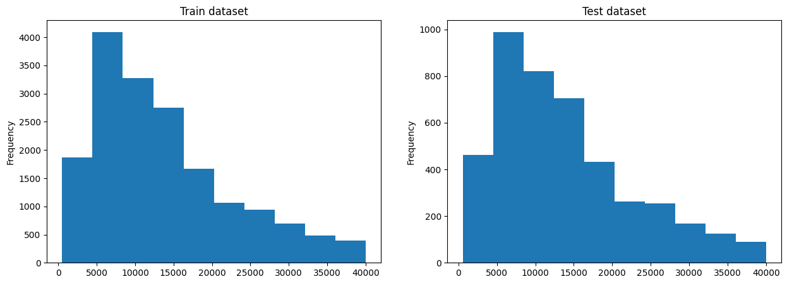
</div>

### Building up to multimodal

Three single modality models were trained first, each establishing what its own signal is worth.

| Component | Role | Details |
|---|---|---|
| **MLP** | Structured data baseline | Two hidden layers (128 and 64 neurons), ReLU, dropout 0.2, Adam at 1e-4, L1Loss, learning rate reduction on plateau and early stopping |
| **BERT** | Text encoder | `dumitrescustefan/bert-base-romanian-uncased-v1`, 110M parameters, pretrained on 15 GB of Romanian text. Fine-tuned in two stages: masked language modelling at 15% masking, then a regression head on the `[CLS]` token |
| **FastViT** | Image encoder | FastViT T8 pretrained on IMAGENET1K, a hybrid CNN and ViT architecture. Fine-tuned for regression on the `[CLS]` token, with the built-in augmentation pipeline (flip, rotate, zoom, resize to 256x256) |

`L1Loss` was chosen over `L2Loss` deliberately: some outliers survive in a self-scraped dataset and squaring the error would let them dominate training.

### Final architecture

The two fine-tuned encoders are frozen and used purely as feature extractors. Their `[CLS]` embeddings are concatenated with the structured features into a **1546 dimensional** input vector, which feeds a small MLP head.

<div align="center">
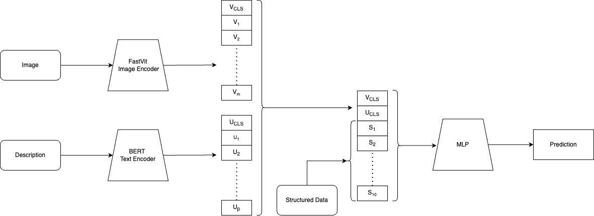
</div>

```python
model = nn.Sequential(
    nn.Linear(1546, 128),
    nn.ReLU(),
    nn.Dropout(0.2),
    nn.Linear(128, 64),
    nn.ReLU(),
    nn.Dropout(0.2),
    nn.Linear(64, 1),
)
```

Unfreezing the encoders for full end-to-end fine-tuning is left as future work.

---

## 📊 Results

Three metrics were tracked: **MAE** (average absolute error, less sensitive to outliers), **MSE** (penalises large errors more heavily) and **R²** (share of variance the model explains).

| Model | Environment | MAE (EUR) | R² |
|---|---|---|---|
| **MLP** (structured only) | Train | 1650 | 0.900 |
| | Test | 1698 | 0.895 |
| **FastViT** (image only) | Train | 4007 | 0.623 |
| | Test | 4051 | 0.618 |
| **BERT** (text only) | Train | 2427 | 0.850 |
| | Test | 2655 | 0.800 |
| **🏆 Multimodal** | Train | **1522** | **0.936** |
| | Test | **1561** | **0.934** |

The ranking is informative on its own. Structured data carries the most signal, descriptions come second, images third. But the multimodal combination beats every individual model, which is exactly the hypothesis the thesis set out to test: **descriptions and photos contain price information that structured fields do not capture.**

<div align="center">
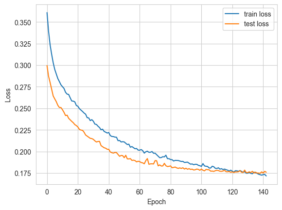
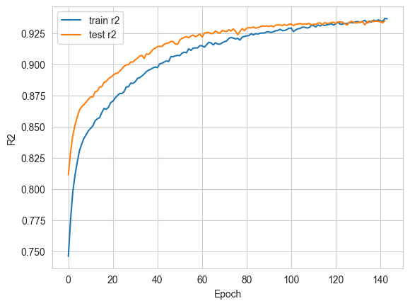
<br><em>Multimodal training curves: loss (MAE) on the left, R² on the right</em>
</div>

Training is stable throughout. The test set tracks slightly better than the train set until around epoch 130, where the two converge, suggesting the test split is marginally easier to predict.

---

## 🌐 The Web Application

RoCar follows a RESTful architecture with a clean separation between the Next.js interface and the FastAPI service, so the model can be consumed by the official UI or by any third party client.

### Backend

**FastAPI** was chosen over Django and Flask for asynchronous request handling (web serving is I/O bound), extensive use of type hints, freedom to pick each component of the stack, Pydantic validation and serialization, and automatic interactive Swagger documentation generated from OpenAPI.

The codebase is split into single responsibility modules following Clean Code principles.

<div align="center">
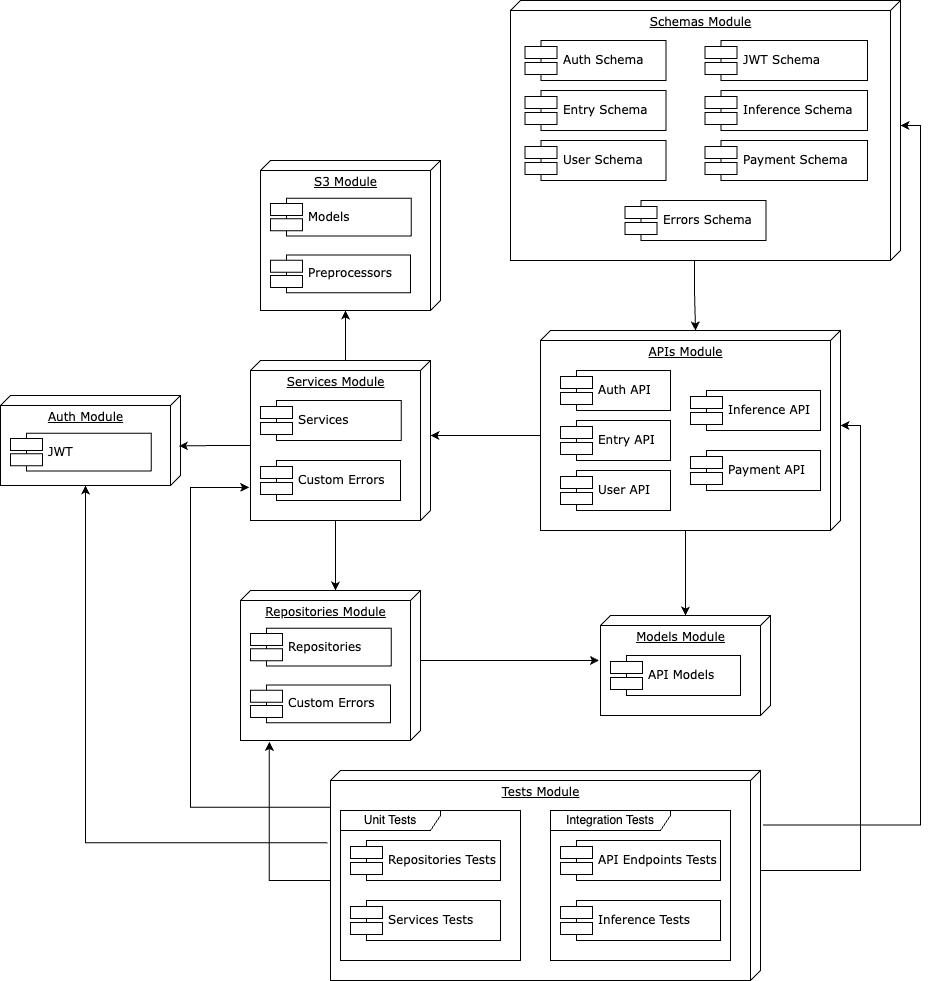
</div>

| Module | Responsibility |
|---|---|
| **Schemas** | Request and response schemas for both success and error cases |
| **APIs** | Endpoint definitions and their documentation |
| **Services** | Business logic, called by the API layer |
| **Repositories** | All database interaction, called only by services |
| **S3** | Configuration and management of AWS S3, downloads models and preprocessors at startup |
| **Auth** | Credentials, sessions and authorization |
| **Models** | ORM data models |
| **Testing** | Unit and integration tests, isolated from application config |

CRUD operations sit behind an abstraction layer so new services and repositories can be added without duplicating code.

<div align="center">
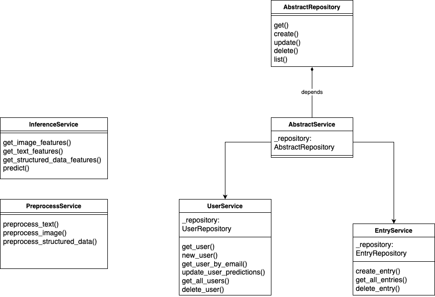
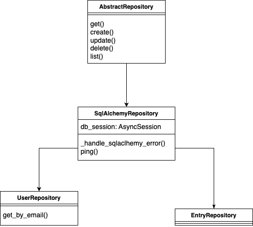
</div>

### API endpoints

All routes are prefixed with `/api/v1` to keep future versions backward compatible.

| Group | Method and path | Purpose |
|---|---|---|
| **Auth** | `POST /login` | Validates credentials and issues a JWT |
| | `POST /register` | Creates an account and returns a JWT immediately |
| **User** | `GET /user/me` | Email, username and remaining predictions |
| **Entry** | `GET /entry/all` | Full prediction history for the user |
| | `DELETE /entry/{id}` | Deletes one prediction entry |
| | `POST /upload` | Uploads an image to S3 and returns its URL |
| **Payment** | `POST /create-checkout-session` | Opens a Stripe checkout session |
| | `POST /webhook` | Receives Stripe events and updates payment state |
| **Inference** | `POST /inference` | 🎯 The core endpoint: returns a predicted price |

```bash
curl -X 'POST' \
  'http://127.0.0.1:8000/api/v1/inference' \
  -H 'accept: application/json' \
  -H 'Authorization: Bearer eyJhbGciOiJIUzI1...' \
  -H 'Content-Type: application/json' \
  -d '{
  "manufacturer": "audi",
  "model": "a3",
  "fuel": "gasoline",
  "chassis": "sedan",
  "sold_by": "company",
  "gearbox": "automatic",
  "km": 100000,
  "power": 160,
  "engine": 1984,
  "year": 2018,
  "description": "test description",
  "image_url": "https://thesis-s3.s3.eu-central-1.amazonaws.com/images/image.webp",
  "audio_and_technology": ["apple carplay", "infotainment system"],
  "comfort_and_optional_equipment": ["heated steering wheel"],
  "electronics_and_assistance_systems": ["rear sensors"],
  "performance": ["alloy wheels 17"],
  "safety": ["abs", "esp"]
}'

{
  "prediction": 15839
}
```

### Data layer

| Technology | Role |
|---|---|
| **PostgreSQL** | Primary database, chosen for reliability, scalability and SQL standards compliance |
| **SQLAlchemy** | ORM mapping tables to Python classes in the Models module |
| **Alembic** | Automatic, reproducible schema migrations across every environment |
| **Amazon S3** | Image storage, with only the URLs kept in Postgres |

The schema is deliberately small (a `user` table and an `entry` table in a one-to-many relationship) and scales by extending the Models module and running a migration.

<div align="center">
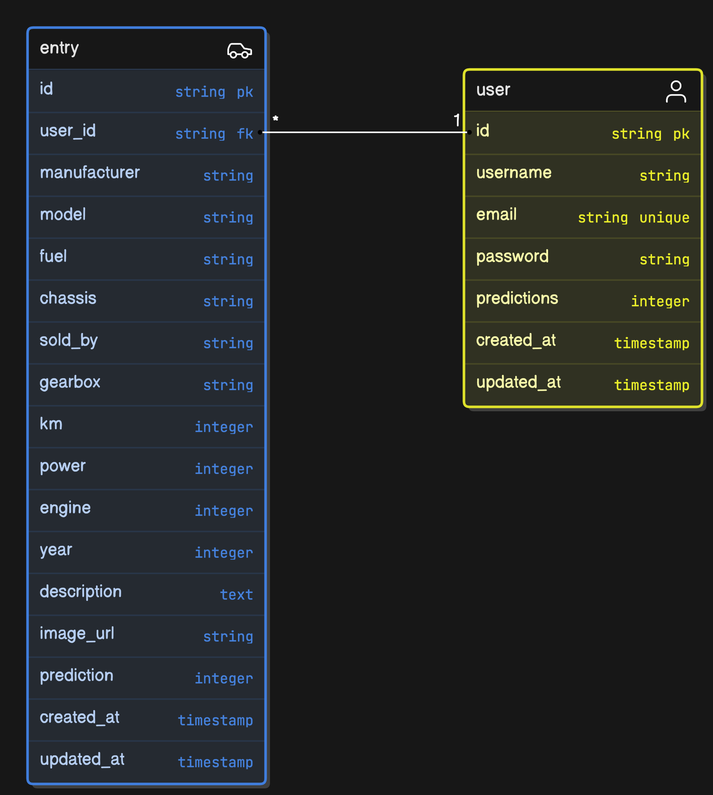
</div>

### Payments

Checkout runs through Stripe, with a webhook keeping the application state in sync with payment outcomes.

<div align="center">
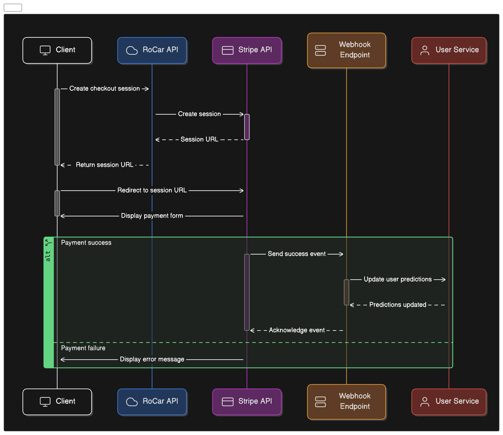
</div>

### Testing

Testing aims to simulate production rather than just pass.

| Suite | Tests | Coverage | Approach |
|---|---|---|---|
| **Unit** | 30 passing | 99% | `pytest` and `pytest-asyncio`, external dependencies mocked, each module tested in isolation |
| **Integration** | 32 passing | 99% | Dedicated database spun up through a custom Docker Compose file and image, every test fully independent |

Repetitive commands run through **poethepoet** tasks defined in `pyproject.toml`:

```
CONFIGURED TASKS
  clean                    Clean up the project
  clean_pycache            Clean up the project of all __pycache__ folders
  unit_test                Clean artifacts and run unittests
    --cov-report           Generate coverage html or xml report
  build_image              Build docker image
    --tag                  Tag of the docker image [default: latest]
  start_app                Start the app
  stop_app                 Stop the app
  integration_test         Run API tests in a new environment
    --cov-report           Generate coverage html or xml report
  create_migration         Create migration
  upgrade_schema           Upgrade database schema
  downgrade_schema         Downgrade database schema
```

### Deployment and CI/CD

GitHub Actions checks code quality, runs the test suites, and signals **Render** to pull and deploy. The Docker image is multi stage:

| Stage | Purpose |
|---|---|
| **Base** | Installs Poetry in the container |
| **Development** | Ready to use environment for contributors, no extra setup needed |
| **Prepare Production** | Drops Poetry and installs dependencies with pip on `python:3.12-slim` to shrink the attack surface |
| **Production** | Runs a bash script that applies migrations and then starts the server |

<div align="center">
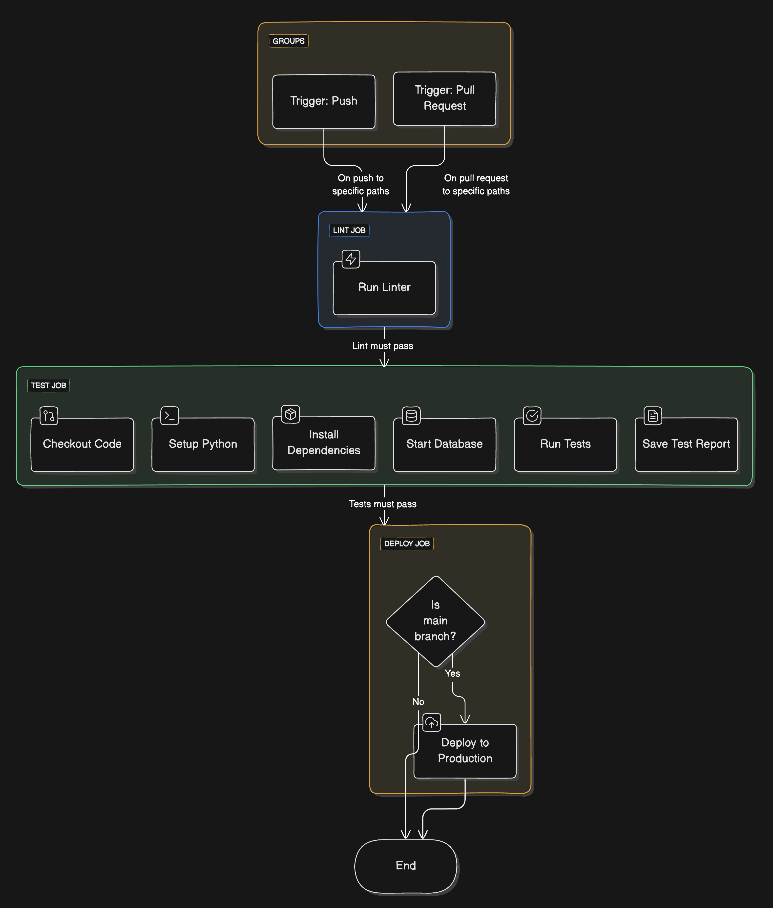
</div>

Across every environment (local, Docker, testing, production) startup first checks whether the latest model and preprocessors are present on the server and downloads them from the S3 bucket only when they are missing.

<div align="center">
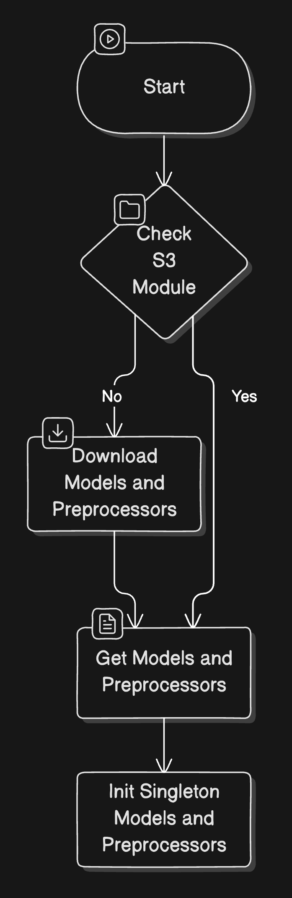
</div>

Secrets live in gitignored `.env` files locally, in GitHub secrets for CI, and in Render and Vercel secrets in production, with separate files per stage.

### Frontend

Built with **Next.js** for caching, server side rendering and React Server Components, styled with **Shadcn** on top of **Tailwind CSS** for full control over the design. Deployed on **Vercel** with zero downtime deploys, triggered automatically whenever `main` changes under the frontend directory.

| Page | Route type | Purpose |
|---|---|---|
| **Landing** | public | Marketing entry point |
| **Pricing** | public | Package options, redirects to login on purchase |
| **Login** | public | Sign in with an existing account |
| **Register** | public | Create an account, then land on the dashboard |
| **Dashboard** | private | History of previous predictions |
| **Prediction** | private | The main form that drives inference |

---

## 🖼️ App Screenshots


---

## 🚀 Getting Started

### Machine learning core

```bash
conda create --name core python=3.11.8
conda activate core

pip install jupyter==1.0.0 numpy==1.26.4 matplotlib==3.8.3 opencv-python==4.9.0.80 \
            pandas==2.2.1 pillow==10.2.0 black==24.2.0 seaborn missingno scikit-learn \
            category_encoders transformers
pip install accelerate -U
pip install autopredictor langdetect emoji wordcloud timm scipy \
            beautifulsoup4 tabulate lxml patool
```

Install PyTorch for your platform:

```bash
# CUDA enabled GPU (Windows)
pip install torch==2.2.1+cu121 torchvision==0.17.1+cu121 --index-url https://download.pytorch.org/whl/cu121

# CUDA enabled GPU (Linux)
pip install torch==2.2.1+cu121 torchvision==0.17.1+cu121

# CPU only (macOS or Windows)
pip install torch==2.2.1 torchvision==0.17.1
```

Then set `PYTHONPATH` from the project root:

```bash
export PYTHONPATH=.          # Linux and macOS
$env:PYTHONPATH='.'          # Windows PowerShell
set PYTHONPATH=.             # Windows CMD
```

### Backend

The backend uses Python 3.12.2, Poetry and poethepoet. Copy `backend/envs/.env.example` to the environment file you need, then:

```bash
cd backend
poetry install
poe start_app          # docker compose based development environment
poe upgrade_schema     # apply Alembic migrations
poe unit_test          # run the unit suite
poe integration_test   # spin up a test database and run the integration suite
```

Interactive Swagger documentation is served at `/docs` once the server is running.

### Frontend

```bash
cd frontend/rocar-price-prediction
npm install
npm run dev
```

The app is then available at `http://localhost:3000`.

---

## 📚 Documentation

The full development process, every experiment and all implementation details are documented in the thesis paper.

- 📄 **[Thesis (PDF, 56 pages)](https://raw.githubusercontent.com/hutanmihai/bachelor-thesis/main/bachelor-thesis-hutanmihai.pdf)**
- 🎤 **[Defence slides (PDF)](https://raw.githubusercontent.com/hutanmihai/bachelor-thesis/main/docs/thesis-slides.pdf)**
- 📝 **[LaTeX sources](docs/overleaf)**

### Contributions of this work

1. **The largest dataset of Romanian second-hand car listings to date.** Prior work referenced a Romanian dataset of roughly 15,000 quotes. This one triples it at 46,893 advertisements, complete with descriptions and images.
2. **A multimodal approach to car price regression**, demonstrating measurably that text and images add predictive value beyond structured specifications.

### Known limitations and future work

- **Dataset.** Sufficient for analysis and experiments, not yet robust to production edge cases. The plan is a refined scraper with selective manual curation, more structured parameters, standardised exterior and interior photos from fixed angles, and a normalised description format.
- **API.** Missing market statistics and insights over past predictions, currently hosted on a single server that will bottleneck under load, and limited to the Romanian market.
- **Frontend.** Functional and responsive, but visually minimal and due for a redesign.
- **Model.** The encoders stay frozen, so full end-to-end fine-tuning remains unexplored.

---

## 👤 Author

**Hutan Mihai Alexandru**

- GitHub: [@hutanmihai](https://github.com/hutanmihai)
- LinkedIn: [Mihai-Alexandru Hutan](https://www.linkedin.com/in/hutanmihai/)
- Portfolio: [mihaihutan.ro](https://mihaihutan.ro)

<div align="center">
<br>
Bachelor's Thesis, University of Bucharest, Faculty of Mathematics and Computer Science, 2024
</div>
